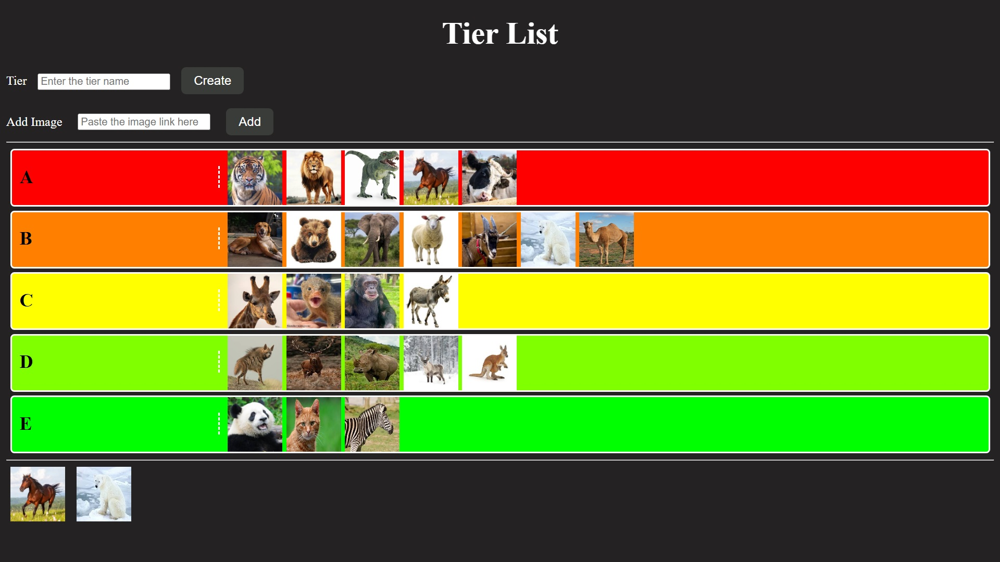
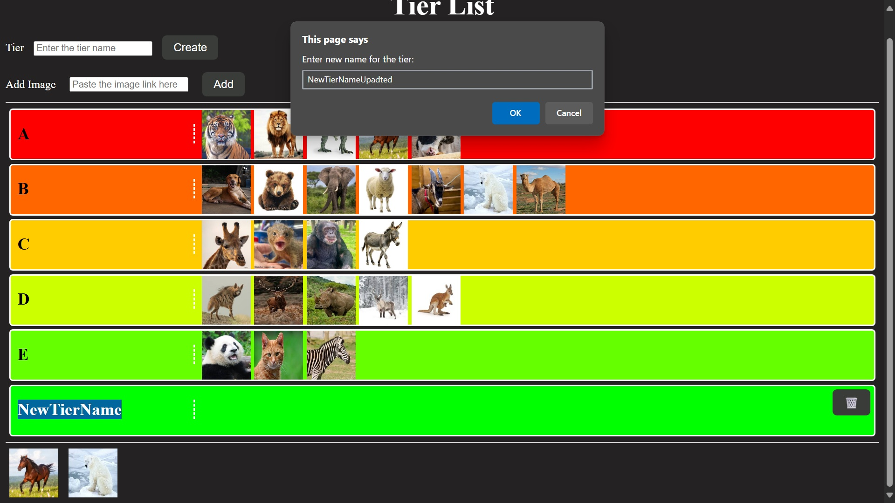
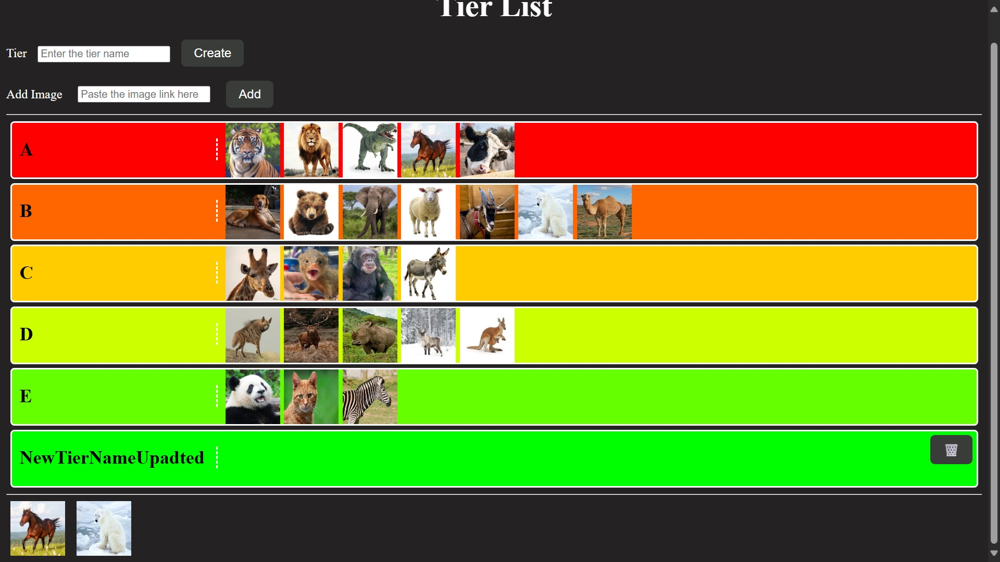
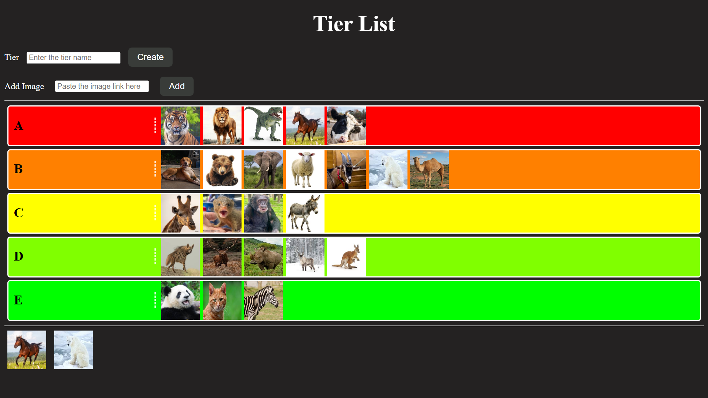

# TierList App

TierList App is a versatile tool for creating and customizing tier lists with an intuitive drag-and-drop interface.

## Features

- 🖱️ Intuitive drag-and-drop interface
- 🎨 Customizable tier names and colors
- 📸 Image upload support (URLs)
- ✏️ Double-click to edit tier names
- 🗑️ Delete tiers with confirmation
- 🌈 Automatic color gradient for tiers

## Getting Started

### Prerequisites
- Modern web browser (Chrome, Firefox, Edge, Safari)
- Internet connection (for loading external images)

### Installation
No installation required! Simply open `Tier.html` in your web browser.

## Usage

### Creating Tiers
1. Enter a tier name in the "Tier" input field
2. Click "Create" or press Enter
3. Double-click a tier name to edit it

### Adding Images
1. Paste an image URL in the "Add Image" field
2. Click "Add" or press Enter

### Organizing Your Tier List
- Drag images from the bottom section into your tiers
- Reorder items within tiers by dragging
- Double-click an image to return it to the unranked section
- Click the trash icon (🗑️) to delete a tier

## Advanced Features

### Keyboard Shortcuts
- Press Enter in any input field to submit
- Double-click to edit tier names

### Customization
- Tiers are automatically colored in a gradient from red to green
- Edit tier names at any time by double-clicking

## Troubleshooting

**Problem:** Images aren't loading
**Solution:** Ensure the URL points directly to an image file (.jpg, .png, etc.)

**Problem:** Can't drag items
**Solution:** Make sure you're dragging from the image container, not the image itself

## Contributing

Contributions are welcome! Please fork the repository and submit a pull request with your improvements.

## License

This project is open-source.

## Roadmap

Planned future features:
- Local storage for saving tier lists
- Drag-and-drop from local files
- Export/import functionality
- Tier locking
- Collaborative editing(Advanced)